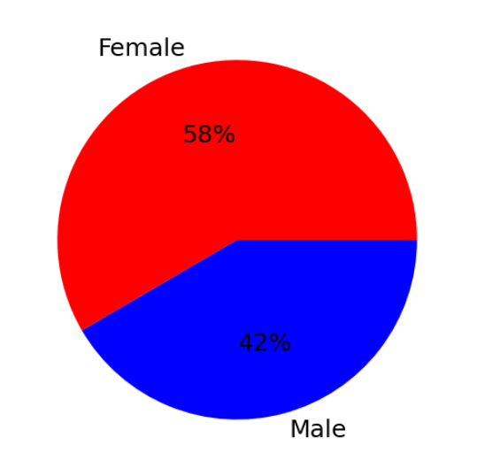
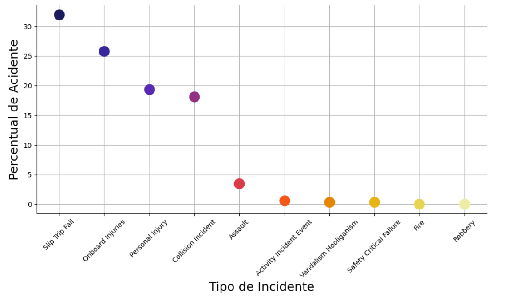
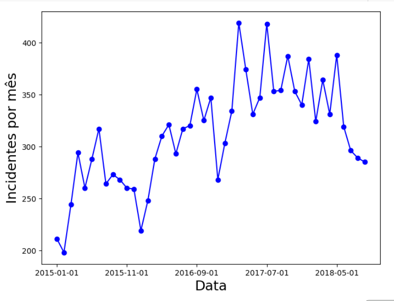
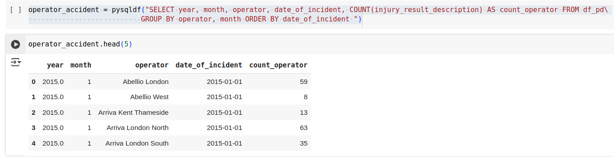
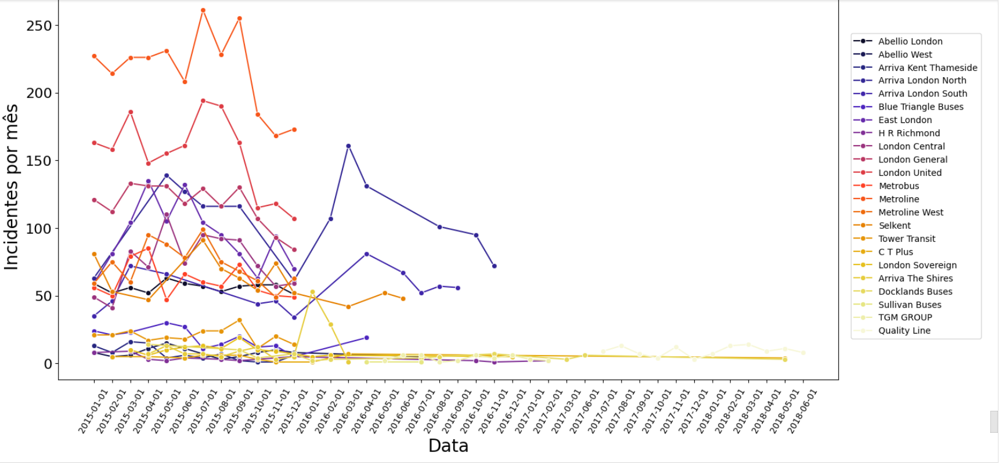

# Data Analysis Project Assessment from Data Science Academy

## Project: Risk Analysis in Public Transportation

What traffic incidents occur most frequently? Which age group is most involved in traffic incidents? What is the most common event in incidents? Are passengers or pedestrians the major victims of incidents? These and other questions should be answered through the analysis of publicly available real data. This project does not require Machine Learning, and your job is to apply your analytical skills and answer various business questions through graphs and storytelling.

For the construction of this project, we recommend using Python Programming Language and SQL Language, and the dataset available for download at the link below:
https://data.world/makeovermonday/2018w51

The dataset lists traffic incidents that occurred in the city of London.

Your job is to analyze the data and create graphs that answer these 10 questions below:

1. What is the number of incidents by gender?
2. Which age group was most involved in incidents?
3. What is the percentage of incidents by event type (Incident Event Type)?
4. How did incidents evolve by month over time?
5. When the incident was "Collision Incident," in which month was there the highest number of incidents involving females?
6. What was the average number of incidents per month involving children (Child)?
7. Considering the incident description as "Injuries treated on scene" (Injury Result Description column), what is the total number of incidents for males and females?
8. In 2017, which month had the most incidents involving the elderly (Elderly)?
9. Considering the Operator, what is the distribution of incidents over time?
10. What is the most common type of incident involving cyclists?

### Main Business Questions visually answered

1. What is the main incident quantity by gender?

The code answer this question is provided below, along with the respective screenshot of the visualization.

```
gender_accident = pysqldf("SELECT victims_sex, COUNT(injury_result_description) as accident_sex FROM df_pd GROUP BY victims_sex ")
```



3. What is the percentage of incidents by Event type?

The code answer this question is provided below, along with the respective screenshot of the visualization.

```
type_accident = pysqldf("SELECT incident_event_type, COUNT(injury_result_description)* 100.0 / sum(count(*)) over() as accident_type FROM df_pd GROUP BY incident_event_type ORDER BY accident_type DESC")
```



4. How was the monthly incident's evolution?

The code answer this question is provided below, along with the respective screenshot of the visualization.

```
time_accident = pysqldf("SELECT year, month, date_of_incident, COUNT(injury_result_description) as accident_date FROM df_pd GROUP BY year, month")
```



9. In regards to the Operator, which is the distribution of incidents over time?

The code answer this question is provided below, along with the respective screenshot of the visualization.


```
operator_accident = pysqldf("SELECT year, month, operator, date_of_incident, COUNT(injury_result_description) AS count_operator FROM df_pd GROUP BY operator, month ORDER BY date_of_incident ")
```





- For further details of the data exploration analysis, see the attached jupyter notebook in this repository.

# Contributor Covenant Code of Conduct

## Our Pledge

We as members, contributors, and leaders pledge to make participation in our
community a harassment-free experience for everyone, regardless of age, body
size, visible or invisible disability, ethnicity, sex characteristics, gender
identity and expression, level of experience, education, socio-economic status,
nationality, personal appearance, race, caste, color, religion, or sexual
identity and orientation.

We pledge to act and interact in ways that contribute to an open, welcoming,
diverse, inclusive, and healthy community.

## Our Standards

Examples of behavior that contributes to a positive environment for our
community include:

* Demonstrating empathy and kindness toward other contributions that are not aligned with this Code of Conduct, and will communicate reasons for moderation decisions when appropriate.

## Scope

This Code of Conduct applies within all community spaces, and also applies when
an individual, or aggression toward or disparagement of classes of individuals.

**Consequence**: A permanent ban from any sort of public interaction within the
community.

## Attribution

This Code of Conduct is adapted from the [Contributor Covenant][homepage],
version 2.1, available at
[https://www.contributor-covenant.org/version/2/1/code_of_conduct.html][v2.1].

Community Impact Guidelines were inspired by
[Mozilla's code of conduct enforcement ladder][Mozilla CoC].

For answers to common questions about this code of conduct, see the FAQ at
[https://www.contributor-covenant.org/faq][FAQ]. Translations are available at
[https://www.contributor-covenant.org/translations][translations].

[homepage]: https://www.contributor-covenant.org
[v2.1]: https://www.contributor-covenant.org/version/2/1/code_of_conduct.html
[Mozilla CoC]: https://github.com/mozilla/diversity
[FAQ]: https://www.contributor-covenant.org/faq
[translations]: https://www.contributor-covenant.org/translations is officially representing the community in public spaces.
Examples of representing our community include using an official e-mail address,
posting via an official social media account, or acting as an appointed
representative at an online or offline event.

## Enforcement

Instances of abusive, harassing, or otherwise unacceptable behavior may be
reported to the community leaders responsible for enforcement at
[INSERT CONTACT METHOD].
All complaints will be reviewed and investigated promptly and fairly.

All community leaders are obligated to respect the privacy and security of the
reporter of any incident.

## Enforcement Guidelines

Community leaders will follow these Community Impact Guidelines in determining
the consequences for any action they deem in violation of this Code of Conduct:

### 1. Correction

**Community Impact**: Use of inappropriate language or other behavior deemed
unprofessional or unwelcome in the community.

**Consequence**: A private, written warning from community leaders, providing
clarity around the nature of the violation and an explanation of why the
behavior was inappropriate. A public apology may be requested.

### 2. Warning

**Community Impact**: A violation through a single incident or series of
actions.

**Consequence**: A warning with consequences for continued behavior. No
interaction with the people involved, including unsolicited interaction with
those enforcing the Code of Conduct, for a specified period of time. This
includes avoiding interactions in community spaces as well as external channels
like social media. Violating these terms may lead to a temporary or permanent
ban.

### 3. Temporary Ban

**Community Impact**: A serious violation of community standards, including
sustained inappropriate behavior.

**Consequence**: A temporary ban from any sort of interaction or public
communication with the community for a specified period of time. No public or
private interaction with the people involved, including unsolicited interaction
with those enforcing the Code of Conduct, is allowed during this period.
Violating these terms may lead to a permanent ban.

### 4. Permanent Ban

**Community Impact**: Demonstrating a pattern of violation of community
standards, including sustained inappropriate behavior, harassment of an
individual people
* Being respectful of differing opinions, viewpoints, and experiences
* Giving and gracefully accepting constructive feedback
* Accepting responsibility and apologizing to those affected by our mistakes,
  and learning from the experience
* Focusing on what is best not just for us as individuals, but for the overall
  community

Examples of unacceptable behavior include:

* The use of sexualized language or imagery, and sexual attention or advances of
  any kind
* Trolling, insulting or derogatory comments, and personal or political attacks
* Public or private harassment
* Publishing others' private information, such as a physical or email address,
  without their explicit permission
* Other conduct which could reasonably be considered inappropriate in a
  professional setting

## Enforcement Responsibilities

Community leaders are responsible for clarifying and enforcing our standards of
acceptable behavior and will take appropriate and fair corrective action in
response to any behavior that they deem inappropriate, threatening, offensive,
or harmful.

Community leaders have the right and responsibility to remove, edit, or reject
comments, commits, code, wiki edits, issues, and other